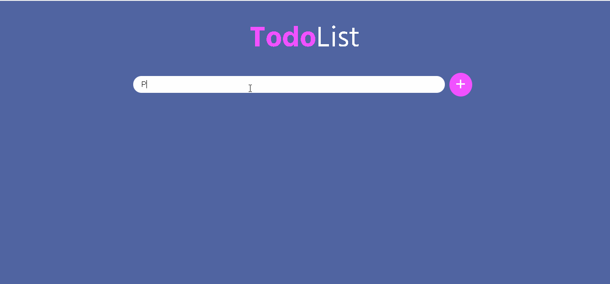

<h1 align="center">TodoList</h1> 

Uma aplicação Web para criação de lista de tarefas feita com HTML, CSS e Javascript

### :mag: Sobre o projeto 
O Todo List é um sistema web que consiste na criação de uma lista de tarefas. É possível criar, editar, excluir e marcar como conclúidas ou desmarcar. Este projeto foi feito para consolidação dos estudos e composição do portfólio.

### 🛠 Tecnologias

Criado apenas utilizando HTML, CSS e Javascript. Será criado um novo projeto igual utilziando o framework React.

### :key: Executar a aplicação

Clone este repositório
$ git clone https://github.com/raissaboeng/todolist.git

Acesse a pasta do projeto no computador e execute o arquivo index.html no navegador.

### :bulb: Melhorias
- [x] Ao marcar uma tarefa como concluída, deixar o label riscado;
- [x] Ao tentar adicionar alguma tarefa, verificar se ela já existe na lista e caso tenha não adicionar;
- [ ] Conectar a aplicação a um banco de dados para não perder as tarefas ao atualizar ou fechar a página;
- [ ] Colocar animação de fundo;

Com 💜 por Raissa Boeng

